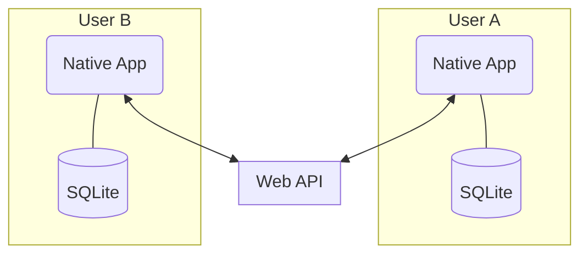

# Music Hub Project Planning and Notes
This repository contains details and scratch for initial planning and establishing an MVP for Music Hub  

## General Thoughts and Notes
- Becuase users are already using DAWs, installing plugins, etc. - they should be willing to download a native application to support the functionality (the most useful functionality might even exist outside of any web apps, with the web apps just serving to connect things)

---

## Features and Functionality

### Easy Sharing of Files and Assets
Sharing and organizing files in a real-time, organized manner that **doesn't** involve uploading files to a server or S3-type storage system ($$$). Instead, the files can just get streamed back and forth between users. This lets us build out the functionality with a more peer-to-peer oriented approach and the data only needs to exist locally. Also, in the same vein, since data is already local - this opens the door to taking advantage of database tools like [SQLite](https://www.sqlite.org/index.html) to index files and handle local app states. 

